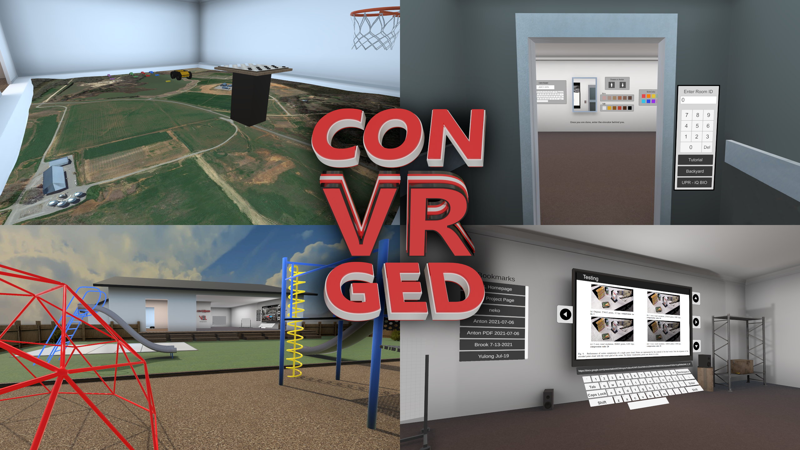

# conVRged

https://vel.engr.uga.edu/projects/virtual-family-room/

conVRged is a multi-purpose XR social application with support for presentations, whiteboards, games, land surveying equipment, and more.

## Installation

### Quest:
[App Lab page](https://www.oculus.com/experiences/quest/4385132461504154 "App Lab Link")

## Development Environment Setup

To compile, you will need to install the Vuplex WebView plugin, which is available here: https://developer.vuplex.com/webview/overview.

To play, always start from the `_Loading.unity` scene. You can also press `F5` from any scene to automatically play from the loading scene.